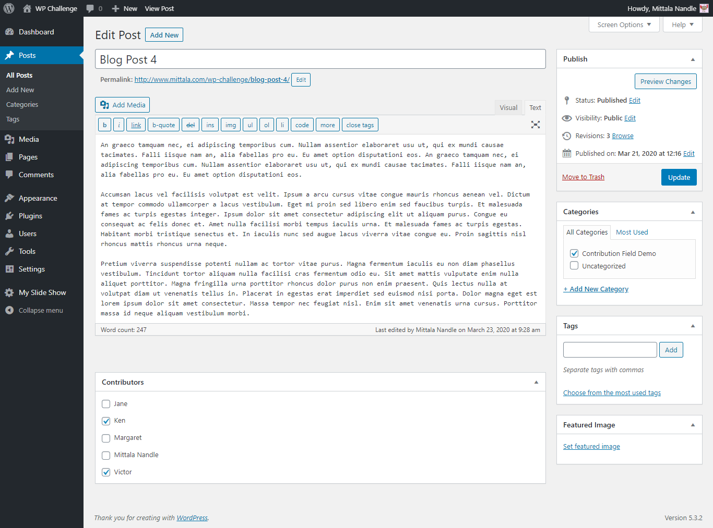
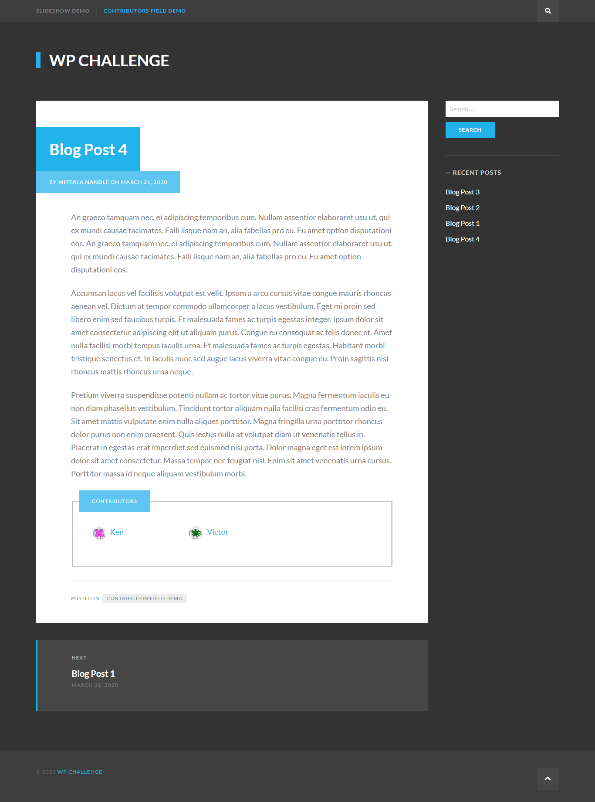

# Custom Fields Plugin
  This repository contains rtCamp Wordpress Engineer Challenge-2b: Custom field for Contributors

## Features provided by this plugin :
* Displays custom field for 'Contributors' in post 
* Add/remove multiple contributors to post
* Display Contributors (with link to profile) on post frontend

## List of Important files :
>1. 'style.css' (Path: /lib/public/css/styles.css)

## Installation and Usage :
>1. Upload 'Custom Fields' directory to '/wp-content/plugins/' 
>2. Activate 'Custom Fields' from Plugins page
>3. Create/Edit posts to add contributors to any post 

##  Link of working plugin demo :

###  **https://www.mittala.com/wp-challenge/blog-post-4/**
  
## Screenshots :
#### Add contributor to post :

#### Display Contributors on post frontend:

